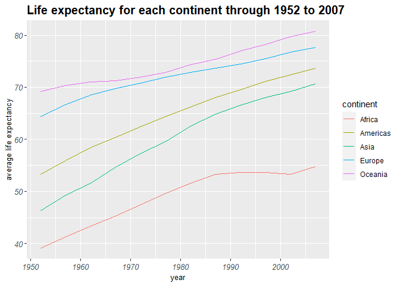
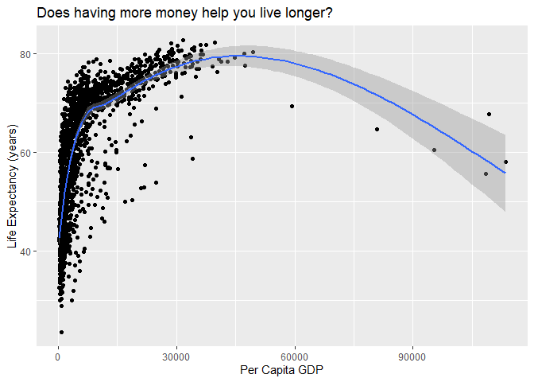
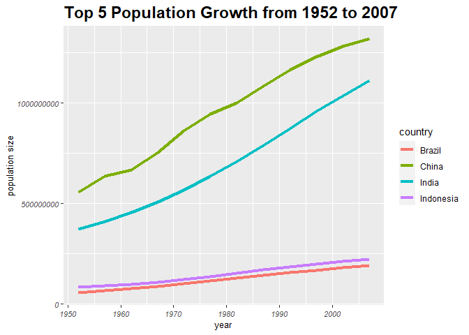
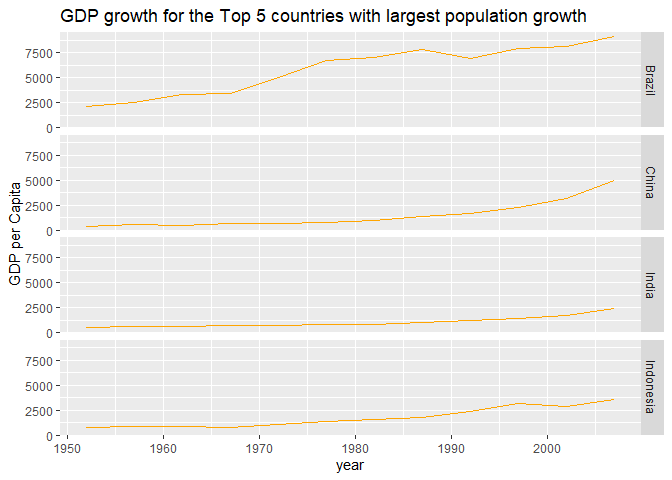

## Instructions
Answer the following questions and complete the exercises in RMarkdown. Please embed all of your code and push your final work to your repository. Your final lab report should be organized, clean, and run free from errors. Remember, you must remove the `#` for the included code chunks to run. Be sure to add your name to the author header above. For any included plots, make sure they are clearly labeled. You are free to use any plot type that you feel best communicates the results of your analysis.  

**In this homework, you should make use of the aesthetics you have learned. It's OK to be flashy!**

Make sure to use the formatting conventions of RMarkdown to make your report neat and clean!  

```r
#install.packages("naniar")
```


## Load the libraries

```r
library(tidyverse)
library(janitor)
library(here)
library(naniar)
```

```r
options(scipen=999)
```

## Resources
The idea for this assignment came from [Rebecca Barter's](http://www.rebeccabarter.com/blog/2017-11-17-ggplot2_tutorial/) ggplot tutorial so if you get stuck this is a good place to have a look.  

## Gapminder
For this assignment, we are going to use the dataset [gapminder](https://cran.r-project.org/web/packages/gapminder/index.html). Gapminder includes information about economics, population, and life expectancy from countries all over the world. You will need to install it before use. This is the same data that we will use for midterm 2 so this is good practice.

```r
#install.packages("gapminder")
library("gapminder")
```

## Questions
The questions below are open-ended and have many possible solutions. Your approach should, where appropriate, include numerical summaries and visuals. Be creative; assume you are building an analysis that you would ultimately present to an audience of stakeholders. Feel free to try out different `geoms` if they more clearly present your results.  

**1. Use the function(s) of your choice to get an idea of the overall structure of the data frame, including its dimensions, column names, variable classes, etc. As part of this, determine how NA's are treated in the data.**  

```r
summary(gapminder)
```

```
##         country        continent        year         lifeExp     
##  Afghanistan:  12   Africa  :624   Min.   :1952   Min.   :23.60  
##  Albania    :  12   Americas:300   1st Qu.:1966   1st Qu.:48.20  
##  Algeria    :  12   Asia    :396   Median :1980   Median :60.71  
##  Angola     :  12   Europe  :360   Mean   :1980   Mean   :59.47  
##  Argentina  :  12   Oceania : 24   3rd Qu.:1993   3rd Qu.:70.85  
##  Australia  :  12                  Max.   :2007   Max.   :82.60  
##  (Other)    :1632                                                
##       pop               gdpPercap       
##  Min.   :     60011   Min.   :   241.2  
##  1st Qu.:   2793664   1st Qu.:  1202.1  
##  Median :   7023596   Median :  3531.8  
##  Mean   :  29601212   Mean   :  7215.3  
##  3rd Qu.:  19585222   3rd Qu.:  9325.5  
##  Max.   :1318683096   Max.   :113523.1  
## 
```

```r
gapminder
```

```
## # A tibble: 1,704 x 6
##    country     continent  year lifeExp      pop gdpPercap
##    <fct>       <fct>     <int>   <dbl>    <int>     <dbl>
##  1 Afghanistan Asia       1952    28.8  8425333      779.
##  2 Afghanistan Asia       1957    30.3  9240934      821.
##  3 Afghanistan Asia       1962    32.0 10267083      853.
##  4 Afghanistan Asia       1967    34.0 11537966      836.
##  5 Afghanistan Asia       1972    36.1 13079460      740.
##  6 Afghanistan Asia       1977    38.4 14880372      786.
##  7 Afghanistan Asia       1982    39.9 12881816      978.
##  8 Afghanistan Asia       1987    40.8 13867957      852.
##  9 Afghanistan Asia       1992    41.7 16317921      649.
## 10 Afghanistan Asia       1997    41.8 22227415      635.
## # ... with 1,694 more rows
```

```r
anyNA(gapminder)
```

```
## [1] FALSE
```

**2. Among the interesting variables in gapminder is life expectancy. How has global life expectancy changed between 1952 and 2007?**


```r
gapminder%>%
  group_by(year)%>%
  summarize(min=min(lifeExp),
            mean=mean(lifeExp),
            max=max(lifeExp))
```

```
## # A tibble: 12 x 4
##     year   min  mean   max
##    <int> <dbl> <dbl> <dbl>
##  1  1952  28.8  49.1  72.7
##  2  1957  30.3  51.5  73.5
##  3  1962  32.0  53.6  73.7
##  4  1967  34.0  55.7  74.2
##  5  1972  35.4  57.6  74.7
##  6  1977  31.2  59.6  76.1
##  7  1982  38.4  61.5  77.1
##  8  1987  39.9  63.2  78.7
##  9  1992  23.6  64.2  79.4
## 10  1997  36.1  65.0  80.7
## 11  2002  39.2  65.7  82  
## 12  2007  39.6  67.0  82.6
```

**3. How do the distributions of life expectancy compare for the years 1952 and 2007?**

```r
gapminder%>%
  filter(year =="1952" | year =="2007")%>%
    group_by(year)%>%
  summarize(mean = mean(lifeExp),
            min = min(lifeExp),
            max = max(lifeExp))
```

```
## # A tibble: 2 x 4
##    year  mean   min   max
##   <int> <dbl> <dbl> <dbl>
## 1  1952  49.1  28.8  72.7
## 2  2007  67.0  39.6  82.6
```

**4. Your answer above doesn't tell the whole story since life expectancy varies by region. Make a summary that shows the min, mean, and max life expectancy by continent for all years represented in the data.**

```r
gapminder%>%
  group_by(continent, year)%>%
  summarize(min = min(lifeExp),
            max = max(lifeExp),
            mean = mean(lifeExp))
```

```
## `summarise()` has grouped output by 'continent'. You can override using the
## `.groups` argument.
```

```
## # A tibble: 60 x 5
## # Groups:   continent [5]
##    continent  year   min   max  mean
##    <fct>     <int> <dbl> <dbl> <dbl>
##  1 Africa     1952  30    52.7  39.1
##  2 Africa     1957  31.6  58.1  41.3
##  3 Africa     1962  32.8  60.2  43.3
##  4 Africa     1967  34.1  61.6  45.3
##  5 Africa     1972  35.4  64.3  47.5
##  6 Africa     1977  36.8  67.1  49.6
##  7 Africa     1982  38.4  69.9  51.6
##  8 Africa     1987  39.9  71.9  53.3
##  9 Africa     1992  23.6  73.6  53.6
## 10 Africa     1997  36.1  74.8  53.6
## # ... with 50 more rows
```

**5. How has life expectancy changed between 1952-2007 for each continent?**

```r
gapminder%>%
    group_by(continent, year)%>%
  summarize(mean = mean(lifeExp))%>%
  ggplot(aes(x=year, y=mean, color=continent))+
  geom_line()+
  labs(title = "Life expectancy for each continent through 1952 to 2007",
       x = "year",
       y = "average life expectancy")+
    theme(plot.title = element_text(size = 15, face = "bold"),
        axis.text = element_text(size = 10, face = "italic"),
        axis.title = element_text(size = 10))
```

```
## `summarise()` has grouped output by 'continent'. You can override using the
## `.groups` argument.
```

<!-- -->

**6. We are interested in the relationship between per capita GDP and life expectancy; i.e. does having more money help you live longer?**

```r
gapminder%>%
  select(lifeExp, gdpPercap)%>%
  ggplot(aes(x=gdpPercap, y=lifeExp))+
  geom_point()+
  geom_smooth(lm=TRUE)+
  labs(title="Does having more money help you live longer?",
       x= "Per Capita GDP",
       y= "Life Expectancy (years)")
```

```
## Warning: Ignoring unknown parameters: lm
```

```
## `geom_smooth()` using method = 'gam' and formula 'y ~ s(x, bs = "cs")'
```

<!-- -->

**7. Which countries have had the largest population growth since 1952?**

```r
popgrowth <- gapminder%>%
  select(country, year, pop)%>%
  pivot_wider(names_from ="year",
              names_prefix="year_",
               values_from ="pop")%>%
  mutate(popgrow = year_2007-year_1952)%>%
  arrange(desc(popgrow))
popgrowth
```

```
## # A tibble: 142 x 14
##    country year_1952 year_1957 year_1962 year_1967 year_1972 year_1977 year_1982
##    <fct>       <int>     <int>     <int>     <int>     <int>     <int>     <int>
##  1 China   556263527 637408000 665770000 754550000 862030000 943455000    1.00e9
##  2 India   372000000 409000000 454000000 506000000 567000000 634000000    7.08e8
##  3 United~ 157553000 171984000 186538000 198712000 209896000 220239000    2.32e8
##  4 Indone~  82052000  90124000  99028000 109343000 121282000 136725000    1.53e8
##  5 Brazil   56602560  65551171  76039390  88049823 100840058 114313951    1.29e8
##  6 Pakist~  41346560  46679944  53100671  60641899  69325921  78152686    9.15e7
##  7 Bangla~  46886859  51365468  56839289  62821884  70759295  80428306    9.31e7
##  8 Nigeria  33119096  37173340  41871351  47287752  53740085  62209173    7.30e7
##  9 Mexico   30144317  35015548  41121485  47995559  55984294  63759976    7.16e7
## 10 Philip~  22438691  26072194  30325264  35356600  40850141  46850962    5.35e7
## # ... with 132 more rows, and 6 more variables: year_1987 <int>,
## #   year_1992 <int>, year_1997 <int>, year_2002 <int>, year_2007 <int>,
## #   popgrow <int>
```

**8. Use your results from the question above to plot population growth for the top five countries since 1952.**

```r
popgrowth%>%
  top_n(5, popgrow)
```

```
## # A tibble: 5 x 14
##   country  year_1952 year_1957 year_1962 year_1967 year_1972 year_1977 year_1982
##   <fct>        <int>     <int>     <int>     <int>     <int>     <int>     <int>
## 1 China    556263527 637408000 665770000 754550000 862030000 943455000    1.00e9
## 2 India    372000000 409000000 454000000 506000000 567000000 634000000    7.08e8
## 3 United ~ 157553000 171984000 186538000 198712000 209896000 220239000    2.32e8
## 4 Indones~  82052000  90124000  99028000 109343000 121282000 136725000    1.53e8
## 5 Brazil    56602560  65551171  76039390  88049823 100840058 114313951    1.29e8
## # ... with 6 more variables: year_1987 <int>, year_1992 <int>, year_1997 <int>,
## #   year_2002 <int>, year_2007 <int>, popgrow <int>
```

```r
gapminder%>%
  filter(country=="China" | country=="India" | country=="Unites States" | country=="Indonesia" | country=="Brazil")%>%
  ggplot(aes(x=year, y=pop, fill=country, color=country))+
  geom_line(size=1.5)+
  labs(title="Top 5 Population Growth from 1952 to 2007",
       x="year",
       y="population size")+
    theme(plot.title = element_text(size = 17, face = "bold"),
        axis.text = element_text(size = 8, face = "italic"),
        axis.title = element_text(size = 10))  
```

<!-- -->

**9. How does per-capita GDP growth compare between these same five countries?**

```r
gapminder%>%
  filter(country=="China" | country=="India" | country=="Unites States" | country=="Indonesia" | country=="Brazil")%>%
  select(country, year, gdpPercap)%>%
  pivot_wider(values_from="gdpPercap",
              names_prefix ="year_",
              names_from="year")%>%
  mutate(growth=year_2007-year_1952)
```

```
## # A tibble: 4 x 14
##   country  year_1952 year_1957 year_1962 year_1967 year_1972 year_1977 year_1982
##   <fct>        <dbl>     <dbl>     <dbl>     <dbl>     <dbl>     <dbl>     <dbl>
## 1 Brazil       2109.     2487.     3337.     3430.     4986.     6660.     7031.
## 2 China         400.      576.      488.      613.      677.      741.      962.
## 3 India         547.      590.      658.      701.      724.      813.      856.
## 4 Indones~      750.      859.      849.      762.     1111.     1383.     1517.
## # ... with 6 more variables: year_1987 <dbl>, year_1992 <dbl>, year_1997 <dbl>,
## #   year_2002 <dbl>, year_2007 <dbl>, growth <dbl>
```

**10. Make one plot of your choice that uses faceting!**

```r
gapminder%>%
  filter(country=="China" | country=="India" | country=="Unites States" | country=="Indonesia" | country=="Brazil")%>%
  ggplot(aes(x=year, y=gdpPercap, fill=country))+
  geom_line(color="orange")+
  facet_grid(country~.)+
  labs(title ="GDP growth for the Top 5 countries with largest population growth",
       x="year",
       y="GDP per Capita",
       fill = "country")
```

<!-- -->

## Push your final code to GitHub!
Please be sure that you check the `keep md` file in the knit preferences. 
