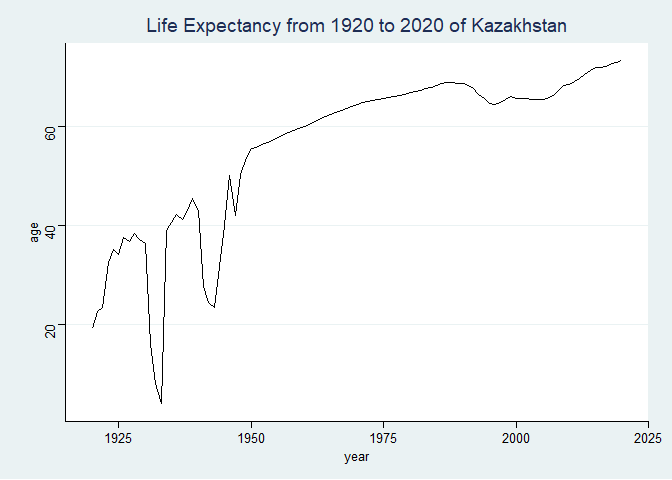
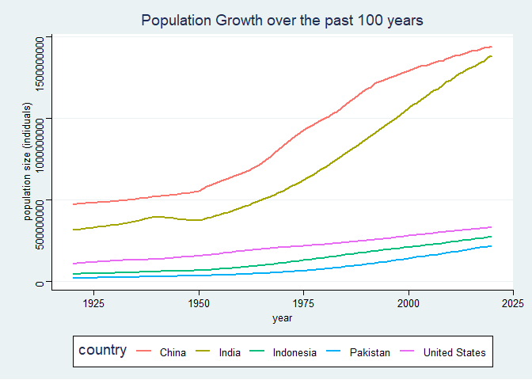
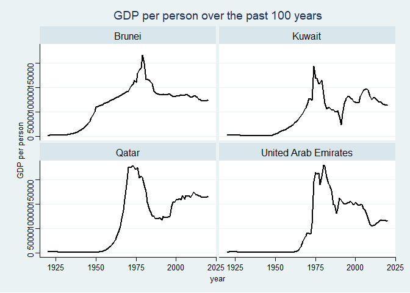
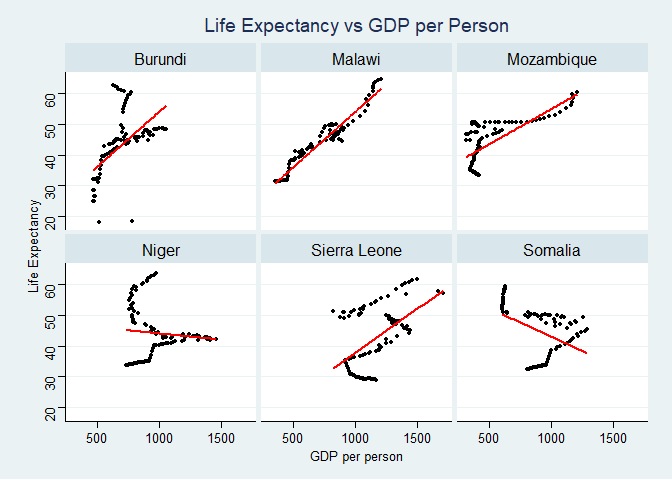

```r
options(scipen=999)
```


```r
library(dplyr)
```

```
## 
## Attaching package: 'dplyr'
```

```
## The following objects are masked from 'package:stats':
## 
##     filter, lag
```

```
## The following objects are masked from 'package:base':
## 
##     intersect, setdiff, setequal, union
```

```r
library(gapminder)
library(tidyverse)
```

```
## -- Attaching packages --------------------------------------- tidyverse 1.3.1 --
```

```
## v ggplot2 3.3.5     v purrr   0.3.4
## v tibble  3.1.6     v stringr 1.4.0
## v tidyr   1.2.0     v forcats 0.5.1
## v readr   2.1.1
```

```
## -- Conflicts ------------------------------------------ tidyverse_conflicts() --
## x dplyr::filter() masks stats::filter()
## x dplyr::lag()    masks stats::lag()
```

```r
library(ggthemes)
```


## Instructions
Answer the following questions and complete the exercises in RMarkdown. Please embed all of your code and push your final work to your repository. Your code should be organized, clean, and run free from errors. Be sure to **add your name** to the author header above. You may use any resources to answer these questions (including each other), but you may not post questions to Open Stacks or external help sites. There are 10 total questions.  

Make sure to use the formatting conventions of RMarkdown to make your report neat and clean! Your plots should use consistent aesthetics throughout.  

This exam is due by **12:00p on Tuesday, February 22**.  

## Gapminder
For this assignment, we are going to use data from  [gapminder](https://www.gapminder.org/). Gapminder includes information about economics, population, social issues, and life expectancy from countries all over the world. We will use three data sets, so please load all three as separate objects.    

1. population_total.csv  
2. income_per_person_gdppercapita_ppp_inflation_adjusted.csv  
3. life_expectancy_years.csv  


```r
population<-readr::read_csv("data/population_total.csv")
```

```
## Rows: 195 Columns: 302
```

```
## -- Column specification --------------------------------------------------------
## Delimiter: ","
## chr   (1): country
## dbl (301): 1800, 1801, 1802, 1803, 1804, 1805, 1806, 1807, 1808, 1809, 1810,...
```

```
## 
## i Use `spec()` to retrieve the full column specification for this data.
## i Specify the column types or set `show_col_types = FALSE` to quiet this message.
```

```r
income<-readr::read_csv("data/income_per_person_gdppercapita_ppp_inflation_adjusted.csv")
```

```
## Rows: 193 Columns: 242
```

```
## -- Column specification --------------------------------------------------------
## Delimiter: ","
## chr   (1): country
## dbl (241): 1800, 1801, 1802, 1803, 1804, 1805, 1806, 1807, 1808, 1809, 1810,...
```

```
## 
## i Use `spec()` to retrieve the full column specification for this data.
## i Specify the column types or set `show_col_types = FALSE` to quiet this message.
```

```r
life<-readr::read_csv("data/life_expectancy_years.csv")
```

```
## Rows: 187 Columns: 302
```

```
## -- Column specification --------------------------------------------------------
## Delimiter: ","
## chr   (1): country
## dbl (301): 1800, 1801, 1802, 1803, 1804, 1805, 1806, 1807, 1808, 1809, 1810,...
```

```
## 
## i Use `spec()` to retrieve the full column specification for this data.
## i Specify the column types or set `show_col_types = FALSE` to quiet this message.
```

1. (3 points) Once you have an idea of the structure of the data, please make each data set tidy (hint: think back to pivots) and store them as new objects. You will need both the original (wide) and tidy (long) data!  

```r
head(population)
```

```
## # A tibble: 6 x 302
##   country  `1800` `1801` `1802` `1803` `1804` `1805` `1806` `1807` `1808` `1809`
##   <chr>     <dbl>  <dbl>  <dbl>  <dbl>  <dbl>  <dbl>  <dbl>  <dbl>  <dbl>  <dbl>
## 1 Afghani~ 3.28e6 3.28e6 3.28e6 3.28e6 3.28e6 3.28e6 3.28e6 3.28e6 3.28e6 3.28e6
## 2 Albania  4   e5 4.02e5 4.04e5 4.05e5 4.07e5 4.09e5 4.11e5 4.13e5 4.14e5 4.16e5
## 3 Algeria  2.5 e6 2.51e6 2.52e6 2.53e6 2.54e6 2.55e6 2.56e6 2.56e6 2.57e6 2.58e6
## 4 Andorra  2.65e3 2.65e3 2.65e3 2.65e3 2.65e3 2.65e3 2.65e3 2.65e3 2.65e3 2.65e3
## 5 Angola   1.57e6 1.57e6 1.57e6 1.57e6 1.57e6 1.57e6 1.57e6 1.57e6 1.57e6 1.57e6
## 6 Antigua~ 3.7 e4 3.7 e4 3.7 e4 3.7 e4 3.7 e4 3.7 e4 3.7 e4 3.7 e4 3.7 e4 3.7 e4
## # ... with 291 more variables: `1810` <dbl>, `1811` <dbl>, `1812` <dbl>,
## #   `1813` <dbl>, `1814` <dbl>, `1815` <dbl>, `1816` <dbl>, `1817` <dbl>,
## #   `1818` <dbl>, `1819` <dbl>, `1820` <dbl>, `1821` <dbl>, `1822` <dbl>,
## #   `1823` <dbl>, `1824` <dbl>, `1825` <dbl>, `1826` <dbl>, `1827` <dbl>,
## #   `1828` <dbl>, `1829` <dbl>, `1830` <dbl>, `1831` <dbl>, `1832` <dbl>,
## #   `1833` <dbl>, `1834` <dbl>, `1835` <dbl>, `1836` <dbl>, `1837` <dbl>,
## #   `1838` <dbl>, `1839` <dbl>, `1840` <dbl>, `1841` <dbl>, `1842` <dbl>, ...
```


```r
population%>%
  summarize(number_nas = sum(is.na(population)))
```

```
## # A tibble: 1 x 1
##   number_nas
##        <int>
## 1          0
```


```r
population_long<-population%>%
  pivot_longer(-country,
               names_to="year",
               values_to="population_size")
population_long
```

```
## # A tibble: 58,695 x 3
##    country     year  population_size
##    <chr>       <chr>           <dbl>
##  1 Afghanistan 1800          3280000
##  2 Afghanistan 1801          3280000
##  3 Afghanistan 1802          3280000
##  4 Afghanistan 1803          3280000
##  5 Afghanistan 1804          3280000
##  6 Afghanistan 1805          3280000
##  7 Afghanistan 1806          3280000
##  8 Afghanistan 1807          3280000
##  9 Afghanistan 1808          3280000
## 10 Afghanistan 1809          3280000
## # ... with 58,685 more rows
```

```r
head(income)
```

```
## # A tibble: 6 x 242
##   country  `1800` `1801` `1802` `1803` `1804` `1805` `1806` `1807` `1808` `1809`
##   <chr>     <dbl>  <dbl>  <dbl>  <dbl>  <dbl>  <dbl>  <dbl>  <dbl>  <dbl>  <dbl>
## 1 Afghani~    603    603    603    603    603    603    603    603    603    603
## 2 Albania     667    667    667    667    667    668    668    668    668    668
## 3 Algeria     715    716    717    718    719    720    721    722    723    724
## 4 Andorra    1200   1200   1200   1200   1210   1210   1210   1210   1220   1220
## 5 Angola      618    620    623    626    628    631    634    637    640    642
## 6 Antigua~    757    757    757    757    757    757    757    758    758    758
## # ... with 231 more variables: `1810` <dbl>, `1811` <dbl>, `1812` <dbl>,
## #   `1813` <dbl>, `1814` <dbl>, `1815` <dbl>, `1816` <dbl>, `1817` <dbl>,
## #   `1818` <dbl>, `1819` <dbl>, `1820` <dbl>, `1821` <dbl>, `1822` <dbl>,
## #   `1823` <dbl>, `1824` <dbl>, `1825` <dbl>, `1826` <dbl>, `1827` <dbl>,
## #   `1828` <dbl>, `1829` <dbl>, `1830` <dbl>, `1831` <dbl>, `1832` <dbl>,
## #   `1833` <dbl>, `1834` <dbl>, `1835` <dbl>, `1836` <dbl>, `1837` <dbl>,
## #   `1838` <dbl>, `1839` <dbl>, `1840` <dbl>, `1841` <dbl>, `1842` <dbl>, ...
```

```r
income%>%
  summarize(number_nas = sum(is.na(income)))
```

```
## # A tibble: 1 x 1
##   number_nas
##        <int>
## 1          0
```


```r
income_long<-income%>%
  pivot_longer(-country,
                names_to="year",
                values_to="income_per_person")
income_long
```

```
## # A tibble: 46,513 x 3
##    country     year  income_per_person
##    <chr>       <chr>             <dbl>
##  1 Afghanistan 1800                603
##  2 Afghanistan 1801                603
##  3 Afghanistan 1802                603
##  4 Afghanistan 1803                603
##  5 Afghanistan 1804                603
##  6 Afghanistan 1805                603
##  7 Afghanistan 1806                603
##  8 Afghanistan 1807                603
##  9 Afghanistan 1808                603
## 10 Afghanistan 1809                603
## # ... with 46,503 more rows
```


```r
head(life)
```

```
## # A tibble: 6 x 302
##   country  `1800` `1801` `1802` `1803` `1804` `1805` `1806` `1807` `1808` `1809`
##   <chr>     <dbl>  <dbl>  <dbl>  <dbl>  <dbl>  <dbl>  <dbl>  <dbl>  <dbl>  <dbl>
## 1 Afghani~   28.2   28.2   28.2   28.2   28.2   28.2   28.1   28.1   28.1   28.1
## 2 Albania    35.4   35.4   35.4   35.4   35.4   35.4   35.4   35.4   35.4   35.4
## 3 Algeria    28.8   28.8   28.8   28.8   28.8   28.8   28.8   28.8   28.8   28.8
## 4 Andorra    NA     NA     NA     NA     NA     NA     NA     NA     NA     NA  
## 5 Angola     27     27     27     27     27     27     27     27     27     27  
## 6 Antigua~   33.5   33.5   33.5   33.5   33.5   33.5   33.5   33.5   33.5   33.5
## # ... with 291 more variables: `1810` <dbl>, `1811` <dbl>, `1812` <dbl>,
## #   `1813` <dbl>, `1814` <dbl>, `1815` <dbl>, `1816` <dbl>, `1817` <dbl>,
## #   `1818` <dbl>, `1819` <dbl>, `1820` <dbl>, `1821` <dbl>, `1822` <dbl>,
## #   `1823` <dbl>, `1824` <dbl>, `1825` <dbl>, `1826` <dbl>, `1827` <dbl>,
## #   `1828` <dbl>, `1829` <dbl>, `1830` <dbl>, `1831` <dbl>, `1832` <dbl>,
## #   `1833` <dbl>, `1834` <dbl>, `1835` <dbl>, `1836` <dbl>, `1837` <dbl>,
## #   `1838` <dbl>, `1839` <dbl>, `1840` <dbl>, `1841` <dbl>, `1842` <dbl>, ...
```

```r
life%>%
  summarize(number_nas = sum(is.na(life)))
```

```
## # A tibble: 1 x 1
##   number_nas
##        <int>
## 1        759
```


```r
life_long<-life%>%
  pivot_longer(-country,
               values_to="life_expectancy",
               names_to="year")%>%
  filter(life_expectancy!="NA")

life_long%>%
  summarize(number_nas = sum(is.na(life_long)))
```

```
## # A tibble: 1 x 1
##   number_nas
##        <int>
## 1          0
```

```r
life_long
```

```
## # A tibble: 55,528 x 3
##    country     year  life_expectancy
##    <chr>       <chr>           <dbl>
##  1 Afghanistan 1800             28.2
##  2 Afghanistan 1801             28.2
##  3 Afghanistan 1802             28.2
##  4 Afghanistan 1803             28.2
##  5 Afghanistan 1804             28.2
##  6 Afghanistan 1805             28.2
##  7 Afghanistan 1806             28.1
##  8 Afghanistan 1807             28.1
##  9 Afghanistan 1808             28.1
## 10 Afghanistan 1809             28.1
## # ... with 55,518 more rows
```

2. (1 point) How many different countries are represented in the data? Provide the total number and their names. Since each data set includes different numbers of countries, you will need to do this for each one.  

```r
income%>%
  count(country)
```

```
## # A tibble: 193 x 2
##    country                 n
##    <chr>               <int>
##  1 Afghanistan             1
##  2 Albania                 1
##  3 Algeria                 1
##  4 Andorra                 1
##  5 Angola                  1
##  6 Antigua and Barbuda     1
##  7 Argentina               1
##  8 Armenia                 1
##  9 Australia               1
## 10 Austria                 1
## # ... with 183 more rows
```

```r
income%>%
  count(country)%>%
  summarize(n=n())
```

```
## # A tibble: 1 x 1
##       n
##   <int>
## 1   193
```


```r
life%>%
  count(country)
```

```
## # A tibble: 187 x 2
##    country                 n
##    <chr>               <int>
##  1 Afghanistan             1
##  2 Albania                 1
##  3 Algeria                 1
##  4 Andorra                 1
##  5 Angola                  1
##  6 Antigua and Barbuda     1
##  7 Argentina               1
##  8 Armenia                 1
##  9 Australia               1
## 10 Austria                 1
## # ... with 177 more rows
```


```r
life%>%
  count(country)%>%
  summarize(n=n())
```

```
## # A tibble: 1 x 1
##       n
##   <int>
## 1   187
```

```r
population%>%
  count(country)
```

```
## # A tibble: 195 x 2
##    country                 n
##    <chr>               <int>
##  1 Afghanistan             1
##  2 Albania                 1
##  3 Algeria                 1
##  4 Andorra                 1
##  5 Angola                  1
##  6 Antigua and Barbuda     1
##  7 Argentina               1
##  8 Armenia                 1
##  9 Australia               1
## 10 Austria                 1
## # ... with 185 more rows
```


```r
population%>%
  count(country)%>%
  summarize(n=n())
```

```
## # A tibble: 1 x 1
##       n
##   <int>
## 1   195
```

## Life Expectancy  

3. (2 points) Let's limit the data to 100 years (1920-2020). For these years, which country has the highest average life expectancy? How about the lowest average life expectancy?  

```r
life_long%>%
  filter(year>="1920" & year<="2020")%>%
  group_by(country)%>%
  summarize(mean_age=mean(life_expectancy))%>%
  arrange(desc(mean_age))%>%
  top_n(1, mean_age)
```

```
## # A tibble: 1 x 2
##   country mean_age
##   <chr>      <dbl>
## 1 Andorra     79.8
```

```r
life_long%>%
  filter(year>="1920" & year<="2020")%>%
  group_by(country)%>%
  summarize(mean_age=mean(life_expectancy))%>%
  arrange(desc(mean_age))%>%
  top_n(-1, mean_age)
```

```
## # A tibble: 1 x 2
##   country                  mean_age
##   <chr>                       <dbl>
## 1 Central African Republic     41.8
```


4. (3 points) Although we can see which country has the highest life expectancy for the past 100 years, we don't know which countries have changed the most. What are the top 5 countries that have experienced the biggest improvement in life expectancy between 1920-2020?  


```r
life_long%>%
  filter(year>="1920" & year<="2020")%>%
  group_by(country)%>%
  summarize(max=max(life_expectancy),
            min=min(life_expectancy))%>%
  mutate(change_life_expectancy=max-min)%>%
  arrange(desc(change_life_expectancy))%>%
  top_n(5, change_life_expectancy)
```

```
## # A tibble: 5 x 4
##   country           max   min change_life_expectancy
##   <chr>           <dbl> <dbl>                  <dbl>
## 1 Kazakhstan       73.1  4.07                   69.0
## 2 Lithuania        75.6 12                      63.6
## 3 Poland           78.5 15.4                    63.1
## 4 Ukraine          71.8  8.94                   62.9
## 5 Kyrgyz Republic  73.1 11.9                    61.2
```

5. (3 points) Make a plot that shows the change over the past 100 years for the country with the biggest improvement in life expectancy. Be sure to add appropriate aesthetics to make the plot clean and clear. Once you have made the plot, do a little internet searching and see if you can discover what historical event may have contributed to this remarkable change.  

```r
life_long
```

```
## # A tibble: 55,528 x 3
##    country     year  life_expectancy
##    <chr>       <chr>           <dbl>
##  1 Afghanistan 1800             28.2
##  2 Afghanistan 1801             28.2
##  3 Afghanistan 1802             28.2
##  4 Afghanistan 1803             28.2
##  5 Afghanistan 1804             28.2
##  6 Afghanistan 1805             28.2
##  7 Afghanistan 1806             28.1
##  8 Afghanistan 1807             28.1
##  9 Afghanistan 1808             28.1
## 10 Afghanistan 1809             28.1
## # ... with 55,518 more rows
```


```r
life_long%>%
  filter(year>="1920" & year<="2020")%>%
  filter(country=="Kazakhstan")%>%
  ggplot(aes(x=as.integer(year), y=life_expectancy))+
  geom_line()+
  theme_stata()+
  labs(title ="Life Expectancy from 1920 to 2020 of Kazakhstan",
       x="year",
       y="age")
```

<!-- -->

## Population Growth
6. (3 points) Which 5 countries have had the highest population growth over the past 100 years (1920-2020)?  

```r
population_long%>%
  filter(year>="1920" & year<="2020")%>%
  group_by(country)%>%
  summarize(max=max(population_size),
            min=min(population_size))%>%
  mutate(change_population_size=max-min)%>%
  arrange(desc(change_population_size))%>%
  top_n(5, change_population_size)
```

```
## # A tibble: 5 x 4
##   country              max       min change_population_size
##   <chr>              <dbl>     <dbl>                  <dbl>
## 1 India         1380000000 317000000             1063000000
## 2 China         1440000000 472000000              968000000
## 3 Indonesia      274000000  47300000              226700000
## 4 United States  331000000 111000000              220000000
## 5 Pakistan       221000000  21700000              199300000
```

```r
population_long
```

```
## # A tibble: 58,695 x 3
##    country     year  population_size
##    <chr>       <chr>           <dbl>
##  1 Afghanistan 1800          3280000
##  2 Afghanistan 1801          3280000
##  3 Afghanistan 1802          3280000
##  4 Afghanistan 1803          3280000
##  5 Afghanistan 1804          3280000
##  6 Afghanistan 1805          3280000
##  7 Afghanistan 1806          3280000
##  8 Afghanistan 1807          3280000
##  9 Afghanistan 1808          3280000
## 10 Afghanistan 1809          3280000
## # ... with 58,685 more rows
```

7. (4 points) Produce a plot that shows the 5 countries that have had the highest population growth over the past 100 years (1920-2020). Which countries appear to have had exponential growth?  

```r
population_long%>%
  filter(year>="1920" & year<="2020")%>%
  filter(country=="India"| country=="China"| country=="Indonesia"| country=="United States"| country=="Pakistan")%>%
  ggplot(aes(x=as.integer(year), y=population_size, color=country))+
  geom_line(size=1)+
  theme_stata()+
  labs(title ="Population Growth over the past 100 years",
       x="year",
       y="population size (indiduals)")
```

<!-- -->

## Income

The units used for income are gross domestic product per person adjusted for differences in purchasing power in international dollars.

```r
income_long
```

```
## # A tibble: 46,513 x 3
##    country     year  income_per_person
##    <chr>       <chr>             <dbl>
##  1 Afghanistan 1800                603
##  2 Afghanistan 1801                603
##  3 Afghanistan 1802                603
##  4 Afghanistan 1803                603
##  5 Afghanistan 1804                603
##  6 Afghanistan 1805                603
##  7 Afghanistan 1806                603
##  8 Afghanistan 1807                603
##  9 Afghanistan 1808                603
## 10 Afghanistan 1809                603
## # ... with 46,503 more rows
```

8. (4 points) As in the previous questions, which countries have experienced the biggest growth in per person GDP. Show this as a table and then plot the changes for the top 5 countries. With a bit of research, you should be able to explain the dramatic downturns of the wealthiest economies that occurred during the 1980's. (1920-2020)

```r
#table
income_long%>%
  filter(year>="1920" & year<="2020")%>%
  group_by(country)%>%
  summarize(max=max(income_per_person),
            min=min(income_per_person))%>%
  mutate(change_income_per_person=max-min)%>%
  arrange(desc(change_income_per_person))%>%
  top_n(5, change_income_per_person)
```

```
## # A tibble: 5 x 4
##   country                 max   min change_income_per_person
##   <chr>                 <dbl> <dbl>                    <dbl>
## 1 United Arab Emirates 179000  1160                   177840
## 2 Qatar                178000  1080                   176920
## 3 Brunei               166000  2130                   163870
## 4 Kuwait               143000  1440                   141560
## 5 Luxembourg            97900  5730                    92170
```


```r
#plot
income_long%>%
  filter(year>="1920" & year<="2020")%>%
  filter(country=="United Arab Emirates"| country=="Qatar"| country=="Brunei"| country=="Kuwait"| country=="Luzembourg")%>%
  ggplot(aes(x=as.integer(year), y=income_per_person))+
  geom_line(size=1)+
  facet_wrap(.~country)+
  theme_stata()+
  labs(title ="GDP per person over the past 100 years",
       x="year",
       y="GDP per person")
```

<!-- -->
NOTE: Drop in GDP per person around the 1980s was a result of a drop in oil prices due to reduced demand and overproduction.

9. (3 points) Create three new objects that restrict each data set (life expectancy, population, income) to the years 1920-2020. Hint: I suggest doing this with the long form of your data. Once this is done, merge all three data sets using the code I provide below. You may need to adjust the code depending on how you have named your objects. I called mine `life_expectancy_100`, `population_100`, and `income_100`. For some of you, learning these `joins` will be important for your project.  


```r
income_100 <- income_long%>%
  filter(year>="1920" & year<="2020")
   
life_100 <- life_long%>%
  filter(year>="1920" & year<="2020")

population_100<- population_long%>%
  filter(year>="1920" & year<="2020")

gapminder_join <- inner_join(life_100, population_100, by= c("country", "year"))
gapminder_join <- inner_join(gapminder_join, income_100, by= c("country", "year"))
gapminder_join
```

```
## # A tibble: 18,728 x 5
##    country     year  life_expectancy population_size income_per_person
##    <chr>       <chr>           <dbl>           <dbl>             <dbl>
##  1 Afghanistan 1920             30.6        10600000              1490
##  2 Afghanistan 1921             30.7        10500000              1520
##  3 Afghanistan 1922             30.8        10300000              1550
##  4 Afghanistan 1923             30.8         9710000              1570
##  5 Afghanistan 1924             30.9         9200000              1600
##  6 Afghanistan 1925             31           8720000              1630
##  7 Afghanistan 1926             31           8260000              1650
##  8 Afghanistan 1927             31.1         7830000              1680
##  9 Afghanistan 1928             31.1         7420000              1710
## 10 Afghanistan 1929             31.2         7100000              1740
## # ... with 18,718 more rows
```

10. (4 points) Use the joined data to perform an analysis of your choice. The analysis should include a comparison between two or more of the variables `life_expectancy`, `population`, or `income.` 
Question: Does a higher GDP indicate a higher life expectancy?

```r
#countries with the smallest change in GDP
gapminder_join%>%
  group_by(country)%>%
  summarize(max=max(income_per_person),
            min=min(income_per_person))%>%
  mutate(change_income_per_person=max-min)%>%
  arrange(change_income_per_person)%>%
  top_n(-6, change_income_per_person)
```

```
## # A tibble: 6 x 4
##   country        max   min change_income_per_person
##   <chr>        <dbl> <dbl>                    <dbl>
## 1 Burundi       1050   467                      583
## 2 Somalia       1290   603                      687
## 3 Niger         1460   735                      725
## 4 Malawi        1210   356                      854
## 5 Sierra Leone  1710   821                      889
## 6 Mozambique    1210   312                      898
```


```r
#plot
gapminder_join%>%
  filter(country=="Burundi"| country=="Somalia"| country=="Niger"| country=="Malawi"| country=="Sierra Leone"| country=="Mozambique")%>%
  ggplot(aes(x=income_per_person, y=life_expectancy))+
  geom_point(size=1)+
  geom_smooth(method="lm", se=FALSE, color="red")+
  facet_wrap(.~country)+
  theme_stata()+
  labs(title ="Life Expectancy vs GDP per Person",
       x="GDP per person",
       y="Life Expectancy")
```

```
## `geom_smooth()` using formula 'y ~ x'
```

<!-- -->
NOTE: I originally thought that life expectancy should be highest when the GDP is highest.  This trend is followed by Mozambique, Malawi, and Sierra Leone.  However, this is not the case for Niger, Somalia, and Burundi.  For Somalia, their highest life expectancy is when their GDP was the lowest.
